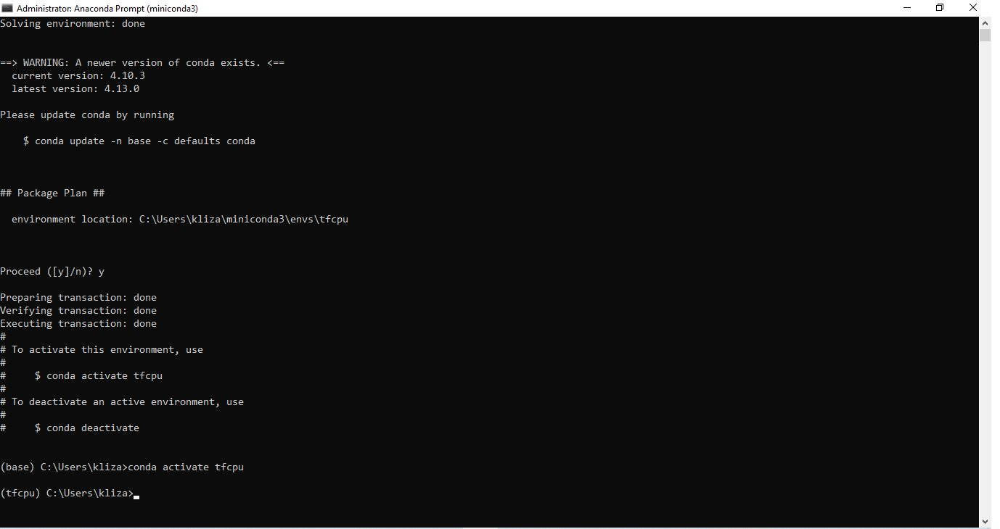
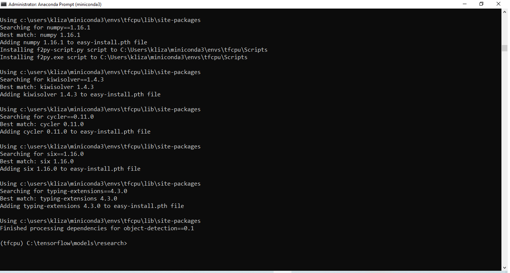

Image-Based Digital Forensic Investigation Framework
========

Green University of Bangladesh -Final Year Thesis
------------------

.. image:: img/gub_logo.png
    :width: 150px
    :align: center

     

Tensorflow Installation
------------------

Learners must go with any one of the following Tensorflow CPU or GPU installations.  

CPU means: You only have a processor in your system. E.g. Intel processor.  
^^^^^^^
GPU means: You only have an NVIDIA graphic card along with the system’s processor.
^^^^^^^

.. image:: img/NVIDIA.png
   

If you don’t have the above option “NVIDIA Control Panel” upon right-clicking on the desktop, you only have to follow 
(a) Tensorflow CPU Installation, whereas if you have the above option, go with (b) Tensorflow GPU installation

Tensorflow CPU installation process
------------------

.. code:: shell

     conda create -n tfcpu
     conda activate tf
     conda install python=3.7.0
     pip install Cython contextlib2 pillow lxml jupyter matplotlib pandas
     opencv-python numpy==1.16.1 flask werkzeug==0.16.0
     pip install tensorflow==1.13.1    

Check whether TensorFlow is appropriately installed or not.  

Python (3.7.0) (no error should populate after installation)  

.. code:: shell

     >>import tensorflow as tf
     >>

Tensorflow GPU installation process
------------------

Download CUDA toolkit 9 or 10   

What is the CUDA toolkit?   

CUDA® is a parallel computing platform and programming model developed by NVIDIA for general computing on graphical processing units (GPUs). With CUDA, developers can dramatically speed up computing applications by harnessing the power of GPUs.

.. code:: shell

     conda create -n tfgpu
     conda activate tfgpu
     conda install python=3.7.0
     pip install Cython contextlib2 pillow lxml jupyter matplotlib pandas
     opencv-python numpy==1.16.1 flask werkzeug==0.16.0
     pip install tensorflow-gpu==1.13.1

Check whether TensorFlow is appropriately installed or not.  

Python (3.7.0) (no error should populate after installation)  

.. code:: shell

     >>import tensorflow as tf
     >>

Tensorflow Framework installation process
------------------

1. Create a folder at the local disk directory.

2. Copy and paste folder “models” and “protos” downloaded from online.

3. Activate your conda env

4. Conda activate tfgpu

   

Navigate to the CD C:/folder/Models/Research>>

(Type the below commands one by one and hit ENTER)

.. code:: shell 
      
      "C:\folder\protoc\bin\protoc.exe" object_detection/protos/*.proto --python_out=.python setup.py install

.. code:: shell 
     
      Set PYTHONPATH=C:\folder\models\research\slim;C:\tensorflow\models\research

Dataset Preparation and Annotation
------------------

1. Prepare the dataset – before feeding it into the machine learning model.
2. Dataset: the combination of a different form of the same data.

Download the free image for the dataset you can try for learning purposes.

       :source: www.kaggle.com
       :source: www.google.com

Image annotation toolkit installation
^^^^^^^
Use the below commands to install the labeling or annotation tool:
^^^^^^^

.. code:: shell 

     pip install PyQt5
     pyrcc5 -o libs/resources.py resources.qrc
     python labelImg.py

1. Install the Image labeling tool.

2. Prepare the image dataset.

3. Decide classifier and perform annotation.

My labeled dataset is Bullets, Pistol, Knife, Scissors, Wine, Hammer, and Blood.

Convert labelled dataset into TF-record

Now it turns to distribute your labelled dataset into two folder

1) Folder “train” should consist of 90% of the entire dataset.

2) Folder “test” should consist of 10% of the entire dataset.

<!-- all link is here -->

### Contact me:

[E-mail](tanvirpoly@gmail.com)

[Facebook]( https://www.facebook.com/tanvirfbid)

[Linkedin]( https://www.linkedin.com/in/tanvirx/)