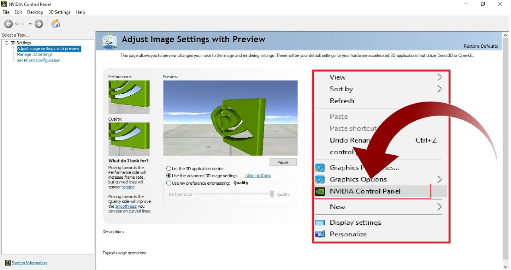

Image-Based Digital Forensic Investigation Framework
========

Green University of Bangladesh -Final Year Thesis
------------------

     

Tensorflow Installation
------------------

Learners must go with any one of the following Tensorflow CPU or GPU installations.  

CPU means: You only have a processor in your system. E.g. Intel processor.  
^^^^^^^
GPU means: You only have an NVIDIA graphic card along with the system’s processor.
^^^^^^^

<!-- all link is here -->

### Contact me:

[E-mail](tanvirpoly@gmail.com)

[Facebook]( https://www.facebook.com/tanvirfbid)

[Linkedin]( https://www.linkedin.com/in/tanvirx/)