Title: An Image-based Digital Forensic Investigation Framework for Crime Analysis
========

=====================================================
 Department of Computer Science and Engineering
=====================================================
:Supervised By: Md. Jahidul Islam
:Designation: Assistant Professor
:Profile: https://green.edu.bd/faculty-profile/dept-of-cse/md-jahidul-islam/
:Authors: Md. Tanvir Ahmed, Razuanul Islam, Atickur Rahman, Jahidul Islam, Anichur Rahman, Sumaiya Kabir
:IEEE Paper: https://ieeexplore.ieee.org/document/10212439
:ResearchGate Paper: https://www.researchgate.net/publication/371110758_An_Image-based_Digital_Forensic_Investigation_Framework_for_Crime_Analysis
:Book in PDF: https://drive.google.com/drive/u/0/folders/1Lrd14dFa8jcT1zdIoSGf5Qx76kkPXh0U

Green University of Bangladesh
------------------

.. image:: image/gub_logo.png
    :width: 150px
    :align: center

     

Our Proposed Methodology
------------------
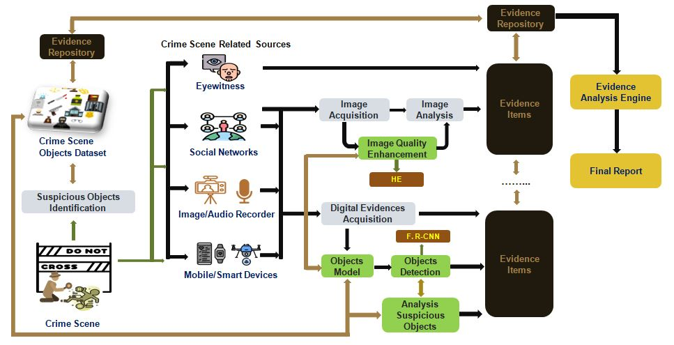

Image Processing
------------------
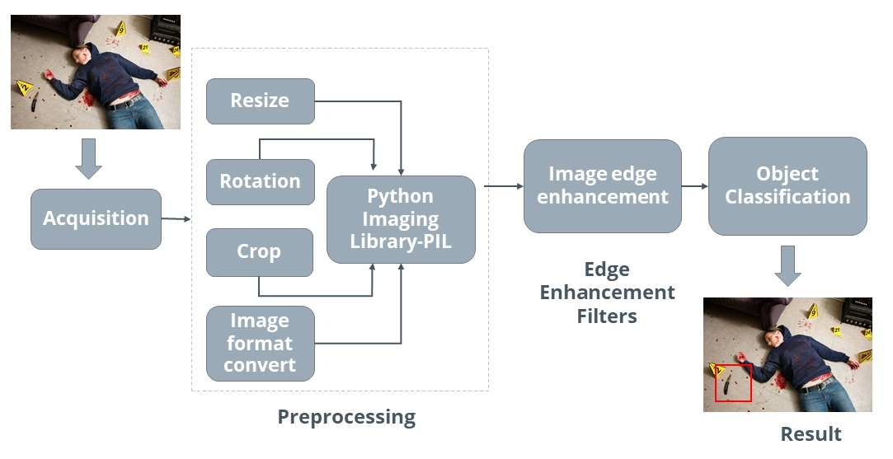

Tensorflow Installation
------------------

Learners must go with any one of the following Tensorflow CPU or GPU installations.  

CPU means: You only have a processor in your system. E.g. Intel processor.  
^^^^^^^
GPU means: You only have an NVIDIA graphic card along with the system’s processor.
^^^^^^^

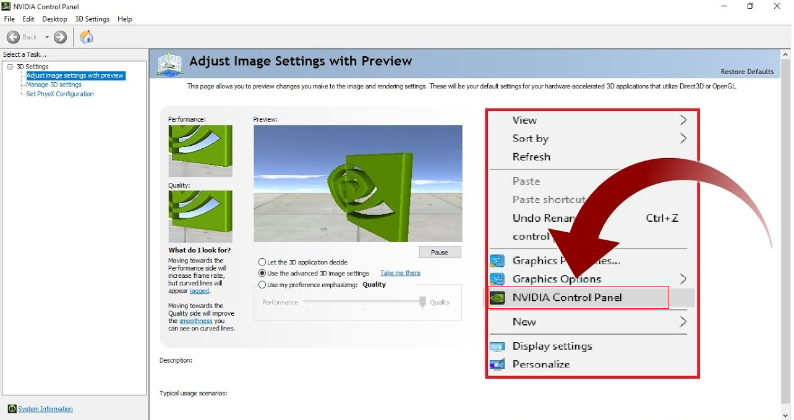
   

If you don’t have the above option “NVIDIA Control Panel” upon right-clicking on the desktop, you only have to follow 
(a) Tensorflow CPU Installation, whereas if you have the above option, go with (b) Tensorflow GPU installation

Tensorflow CPU installation process
------------------

.. code:: shell

     conda create -n tfcpu
     conda activate tf
     conda install python=3.7.0
     pip install Cython contextlib2 pillow lxml jupyter matplotlib pandas
     opencv-python numpy==1.16.1 flask werkzeug==0.16.0
     pip install tensorflow==1.13.1    

Check whether TensorFlow is appropriately installed or not.  

Python (3.7.0) (no error should populate after installation)  

.. code:: shell

     >>import tensorflow as tf
     >>

Tensorflow GPU installation process
------------------

Download CUDA toolkit 9 or 10   

What is the CUDA toolkit?   

CUDA® is a parallel computing platform and programming model developed by NVIDIA for general computing on graphical processing units (GPUs). With CUDA, developers can dramatically speed up computing applications by harnessing the power of GPUs.

.. code:: shell

     conda create -n tfgpu
     conda activate tfgpu
     conda install python=3.7.0
     pip install Cython contextlib2 pillow lxml jupyter matplotlib pandas
     opencv-python numpy==1.16.1 flask werkzeug==0.16.0
     pip install tensorflow-gpu==1.13.1

Check whether TensorFlow is appropriately installed or not.  

Python (3.7.0) (no error should populate after installation)  

.. code:: shell

     >>import tensorflow as tf
     >>

Tensorflow Framework installation process
------------------

1. Create a folder at the local disk directory.

2. Copy and paste folder “models” and “protos” downloaded from online.

3. Activate your conda env

4. Conda activate tfgpu

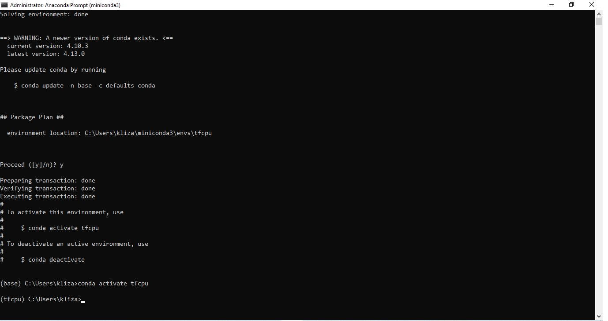
   

Navigate to the CD C:/folder/Models/Research>>

(Type the below commands one by one and hit ENTER)

.. code:: shell 
      
      "C:\folder\protoc\bin\protoc.exe" object_detection/protos/*.proto --python_out=.python setup.py install

.. code:: shell 
     
      Set PYTHONPATH=C:\folder\models\research\slim;C:\tensorflow\models\research

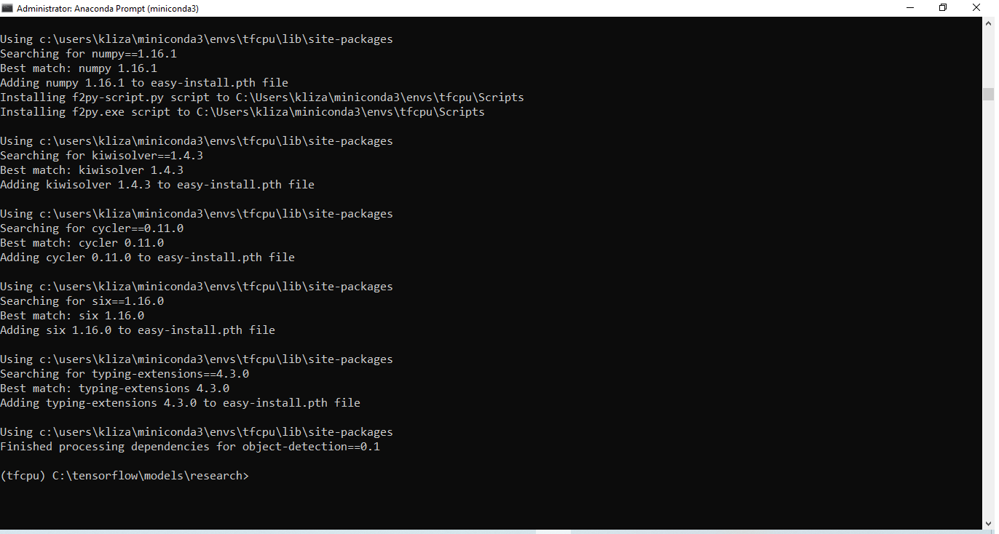

Dataset Preparation and Annotation
------------------

1. Prepare the dataset – before feeding it into the machine learning model.
2. Dataset: the combination of a different form of the same data.

Download the free image for the dataset you can try for learning purposes.

       :source: www.kaggle.com
       :source: www.google.com

Image annotation toolkit installation
^^^^^^^
Use the below commands to install the labeling or annotation tool:
^^^^^^^

.. code:: shell 

     pip install PyQt5
     pyrcc5 -o libs/resources.py resources.qrc
     python labelImg.py

1. Install the Image labeling tool.

2. Prepare the image dataset.

3. Decide classifier and perform annotation.

My labeled dataset is Bullets, Pistol, Knife, Scissors, Wine, Hammer, and Blood.

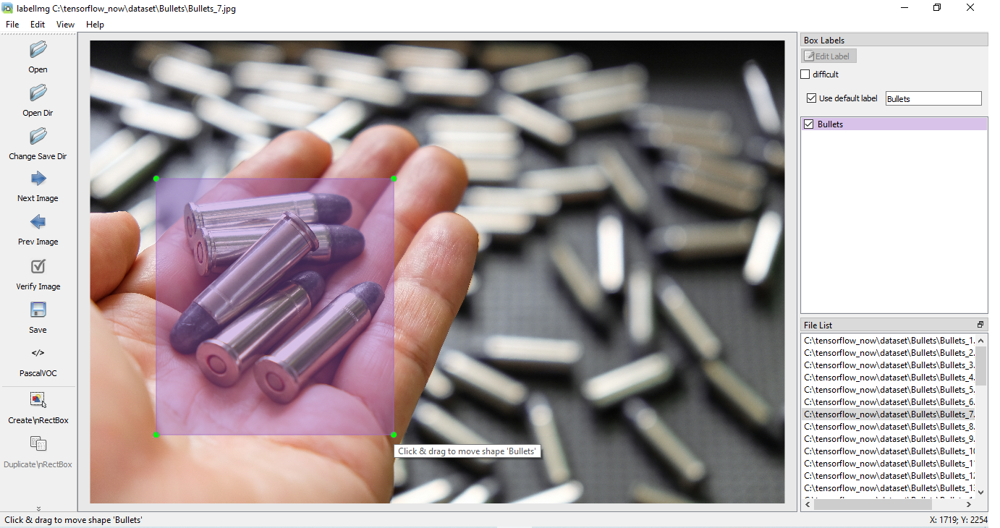

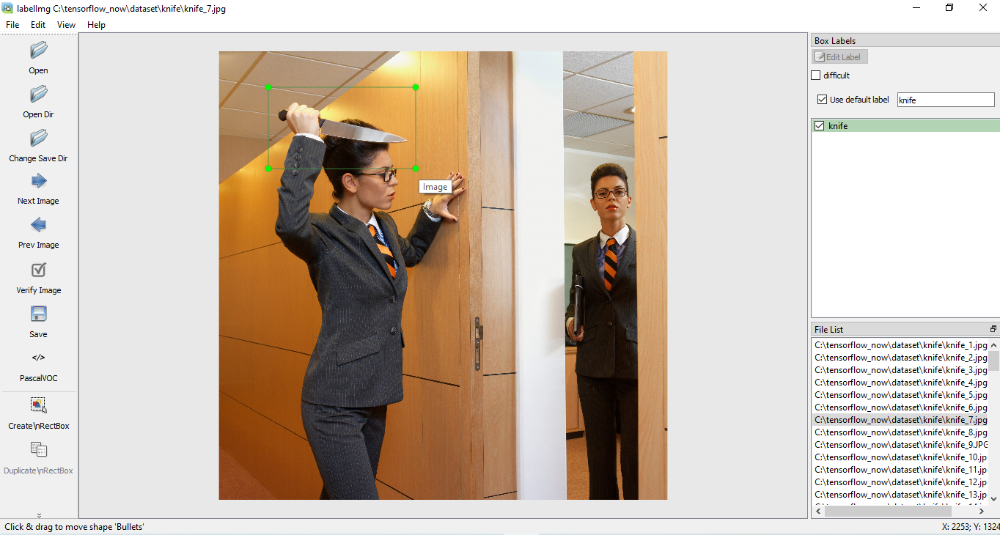

Convert labelled dataset into TF-record
------------------

Now it turns to distribute your labelled dataset into two folder

1) Folder “train” should consist of 90% of the entire dataset.

2) Folder “test” should consist of 10% of the entire dataset.

Now apply this command

.. code:: shell 

      set PYTHONPATH=C:\folder\models\research\slim;C:\tensorflow\models\research

1. XML format convert to CSV format

.. code:: shell 

      Python xml_to_csv.py

Using the above command twice by changing the folder name will result in the below two files.

.. code:: shell  

     >> test.csv
     >> train.csv

CSV format convert to TF-RECORD format

1) Move test and train folder to the folder/models/research/object_detection
2) Also, move the generate_ftrecord.py file to the same folder
3) Mention your classifier name (line 39,41)
4) Bullets, Pistol, Knife, Scissors, Wine, Hammer, and Blood.
5) Navigate folder/models/research/object_detection
6) Generate test.record and train.record

.. code:: shell 

      set PYTHONPATH=C:\folder\models\research\slim;C:\tensorflow\models\research

For Test.record
^^^^^^^

.. code:: shell 

     python generate_tfrecord.py --csv_input=C:/folder/models/research/object_detection/test/test_labels.csv --output_path=C:/folder/models/research/object_detection/test/test.record

For Train.record
^^^^^^^

.. code:: shell    

      python generate_tfrecord.py --csv_input=C:/folder/models/research/object_detection/train/train_labels.csv --output_path=C:/folder/models/research/object_detection/train/train.record

Now Train the model
------------------

1. Download the SSD model file

2. Download Labelmap.pbtxt

3. Download SSD Config File

Navigate to the ./object_detection/legacy folder

1) Create “data” folder -> paste train.record and test.record in it

2) Create a training folder.

3) Edit labelmap.pbtxt with your classifier name (e.g. Bullets, Pistol, Knife, Scissors, Wine, Hammer, and Blood. etc.) and copy-paste labelmap.pbtxt to the “data” and “training” folder

4) Paste the SSD config file into the training folder

5) Edit SSD config file with batch size, training step, etc

6) Copy the downloaded SSD model file (120MB) and paste it into legacy.

.. code:: shell 

      set PYTHONPATH=C:\folder\models\research\slim;C:\tensorflow\models\research

Run the below commands to start training (I will suggest copying first in notepad and then pasting to anaconda prompt)

.. code:: shell 

      python train.py --logtostderr --train_dir=training/ --pipeline_config_path=training/ssd_mobilenet_v1_coco.config

Generate Model Graph and Deployment
------------------

Copy export_inference_graph.py from the object detection folder and paste it into legacy dir.
Use the below command by editing “model name” and “your_step_number.”

.. code:: shell 

      python export_inference_graph.py --input_type image_tensor --pipeline_config_path training/ssd_mobilenet_v1_coco.config--trained_checkpoint_prefix training/model.ckpt-your_step_number --output_directory model_name

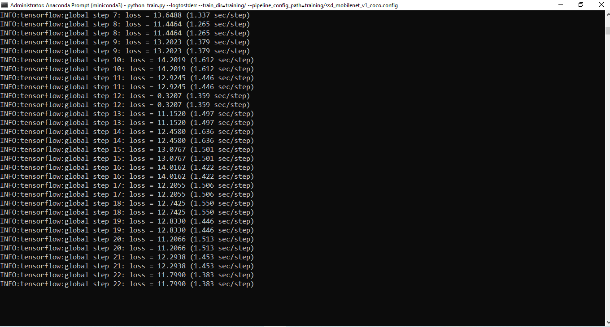

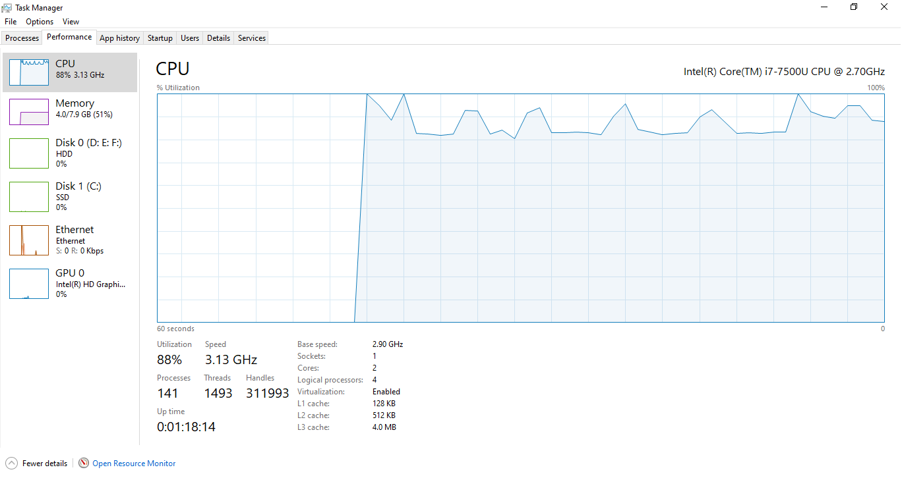

Check how the model is trained with the help of tensorboard (run below command in legacy folder)

.. code:: shell 

      tensorboard --logdir ./ --host=127.0.0.1

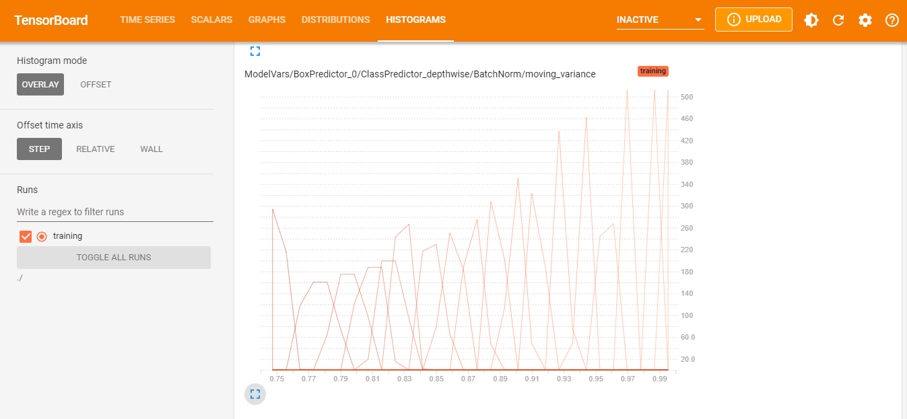

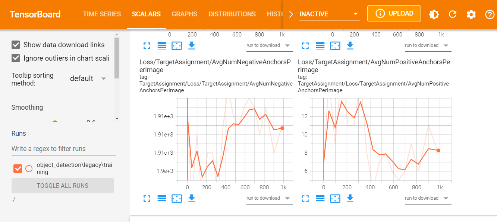

If tensorboard error occurred, then the following command should be used.

.. code:: shell 

      pip install tb-nightly

Download the web server code from Google to detect the object with the web browser.

Now use the following commands:

.. code:: shell 

      Set flask_env=development
      Flask run

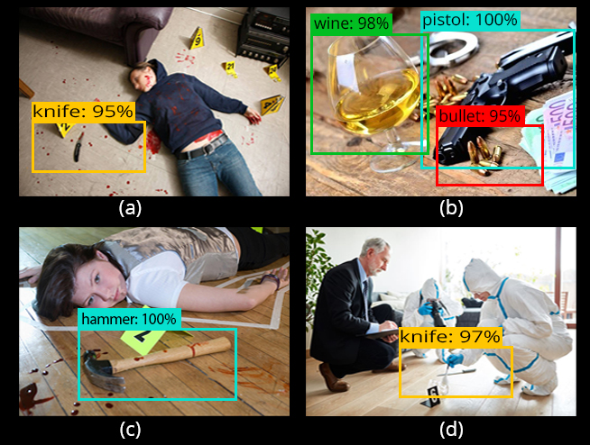

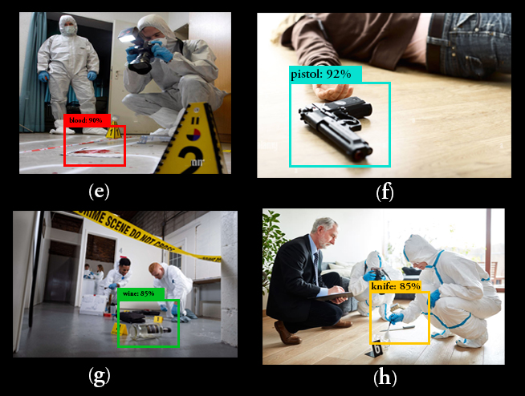

Image Enhancement
------------------

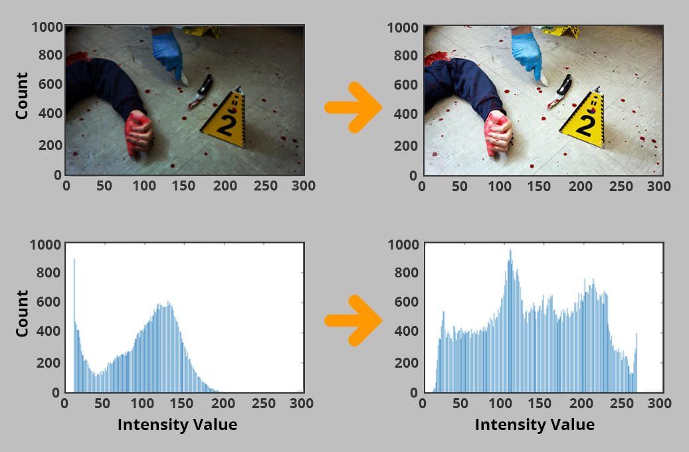

Contact me:
------------------

 `E-mail <tanvirpoly@gmail.com>`__

 `Facebook <https://www.facebook.com/tanvirfbid>`__

 `Linkedin <https://www.linkedin.com/in/tanvirx/>`__
